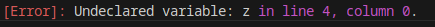

# <span style="color:blue"> GREEK BASE </span>
## Authors:
* Jakub Łabuz: [jlabuz@student.agh.edu.pl](mailto:jlabuz@student.agh.edu.pl)
* Jarosław Mastalerczyk: [jarekmast@student.agh.edu.pl](mailto:jarekmast@student.agh.edu.pl)

## Project description:
* Own programming language „GreekBase”.
* The aim for this project is to create an experimental programming language inspired by [Ada](https://www.adacore.com/about-ada)'s rules and syntax for [*Compilation Theory and Compilers*](https://sylabusy.agh.edu.pl/pl/1/2/19/1/4/16/140#nav-tab-10) classes. We want to change it a bit and make it more convenient, for example with built-in list operations and some other enhancements.
* Implemented in **Python** using [ANTLR4](https://www.antlr.org).
* Language compiled to **C** (exact features: TBA, probably at the end of the main development, just around the time of the project evaluation).

## Project structure
```
GreekBase
├── antlr/
│   ├── GreekBaseLexer.g4             ← grammar for tokens
│   ├── GreekBaseParser.g4            ← grammar for parser
│   └── generated/                    ← folder containing files generated by ANTLR
│       ├── GreekBaseLexer.py         ← generated lexer (token scanner)
│       ├── GreekBaseParser.py        ← generated parser
│       └── GreekBaseParserVisitor.py ← generated visitor (used by AST tree builder)
├── src/
│   ├── ast_builder.py                ← used for generating AST tree from ANTLR tree
│   ├── astGreek.py                   ← AST tree node classes
│   ├── semantic_checker.py           ← semantic errors handling etc.
│   ├── codegen.py                    ← C (from AST) code generator
│   ├── compiler_core.py              ← logic of compiler used in main and gui
│   └── gui.py                        ← graphic interface for compiler
├── inputs/                           ← example source files
├── output/                           ← generated C source files
├── run.sh                            ← bash (Linux etc.) script for generating ANTLR files
├── run.bat                           ← bat (Windows) equivalent of the above one
└── main.py                           ← main file that starts the compiler
```
## Reguirements
Project uses python packages e.g. for GUI and colouring.
They can be installed (or overviewed: ./[requirements.txt](./requirements.txt)):
```bash
pip install -r ./requirements.txt
```
## Details

### 1. Grammar
[Lexer's tokens](antlr/GreekBaseLexer.g4)

[Parser's grammar](antlr/GreekBaseParser.g4)

### 2. Tutorial
1. Please run
	./[run.sh](./run.sh)
in order to generate the parser and its tools needed later, but they should be already generated in ./[antlr/generated/](./antlr/generated/).

Example input files are in ./[inputs](./inputs) directory and they have .gb extension. 
For now, printing the Abstract Syntax Tree is possible, as well as receiving semantic errors and warnings in the console.
Output C source file is (by default) saved to ./[output/](./output/) directory if there are no [Error]s. 

2. You can use the graphical interface by running the ./[main.py](./main.py) file without any arguments. 

3. For specific information about the compiler usage in command line interface, you can run:
```
python main.py --help
```

4. Compile the GreekBase language source file by typing its path as the first argument:
```
python main.py example.gb
```

5. There is an option: -o output_path:
```
python main.py example.gb -o my_path/my_name.c
```

### 3. Example
1. Source file (.gb):
```ada
x : int := 5;
y : int := 10;

if x < y then
    x := x + 1;
else y := y - 1;
end if;

while x < y {
    print x;
    x := x + 1;
}

print x;
print y;
```
2. AST tree:
```python
Program(line=1, column=0, statements=[VariableDeclaration(line=1, column=0, varType=<class 'int'>, id='x', varValue=IntLiteral(line=1, column=11, value=5)), VariableDeclaration(line=2, column=0, varType=<class 'int'>, id='y', varValue=IntLiteral(line=2, column=11, value=10)), IfStatement(line=4, column=0, condition=Condition(line=4, column=3, left=Identifier(line=4, column=3, value='x', type=None), operator='<', right=Identifier(line=4, column=7, value='y', type=None)), then_branch=[Assignment(line=5, column=4, id='x', value=AdditionOperator(line=5, column=9, left=Identifier(line=5, column=9, value='x', type=None), operator='+', right=IntLiteral(line=5, column=13, value=1)))], else_branch=[Assignment(line=6, column=5, id='y', value=AdditionOperator(line=6, column=10, left=Identifier(line=6, column=10, value='y', type=None), operator='-', right=IntLiteral(line=6, column=14, value=1)))]), LoopStatement(line=9, column=0, condition=Condition(line=9, column=6, left=Identifier(line=9, column=6, value='x', type=None), operator='<', right=Identifier(line=9, column=10, value='y', type=None)), then=[PrintStatement(line=10, column=4, value=Identifier(line=10, column=10, value='x', type=None)), Assignment(line=11, column=4, id='x', value=AdditionOperator(line=11, column=9, left=Identifier(line=11, column=9, value='x', type=None), operator='+', right=IntLiteral(line=11, column=13, value=1)))]), PrintStatement(line=14, column=0, value=Identifier(line=14, column=6, value='x', type=None)), PrintStatement(line=15, column=0, value=Identifier(line=15, column=6, value='y', type=None))])
```
3. Semantic check:

 (not for this example, here everything is fine)

4. Code in C:
```C
#include <stdio.h>
int main(){
int x = 5;
int y = 10;
if(x < y){
x = x + 1;
}else{ 
y = y - 1;
}
while(x < y){
printf("%d", x);
x = x + 1;
}
printf("%d", x);
printf("%d", y);
return 0;
}

```
